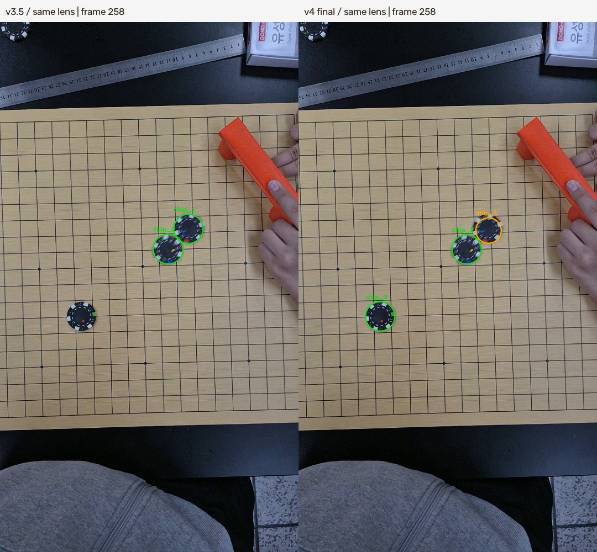
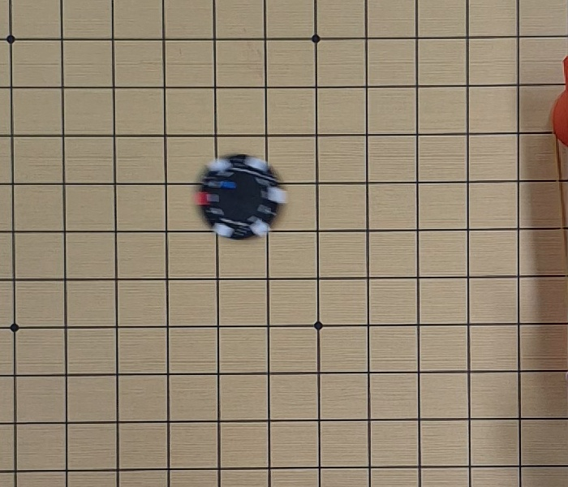
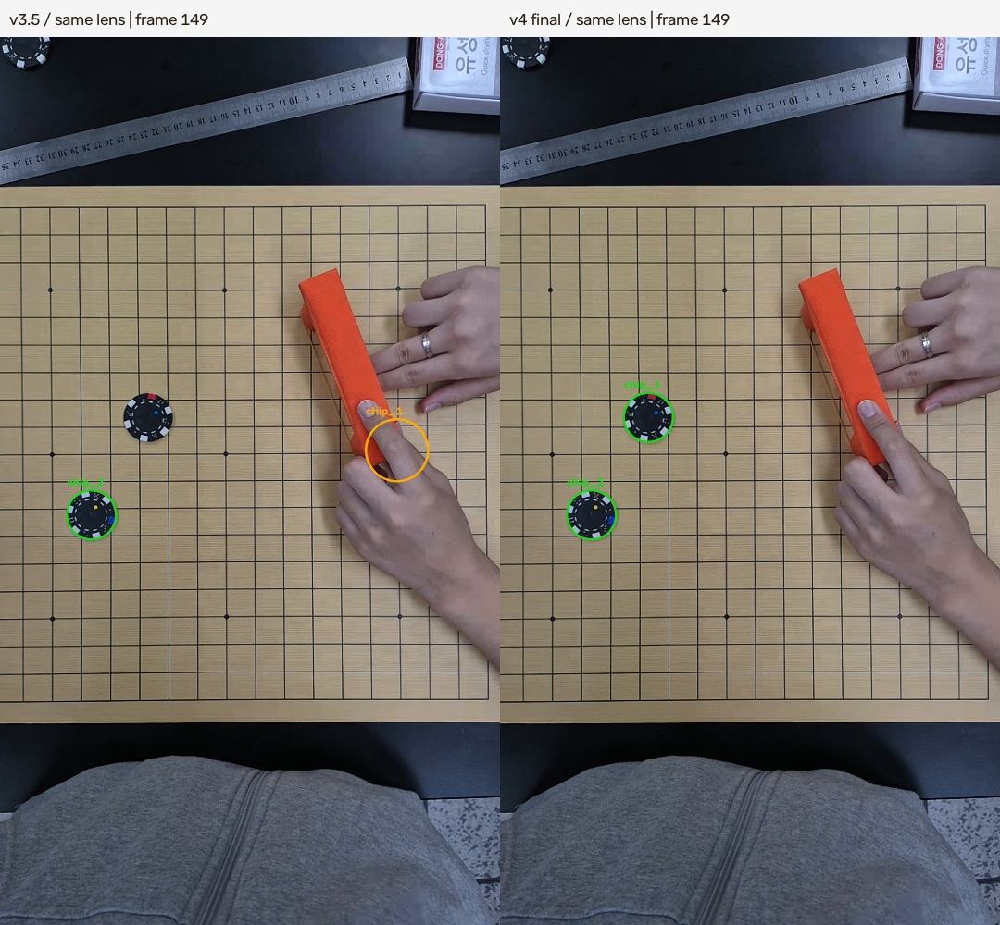
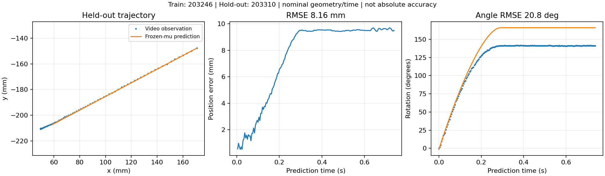
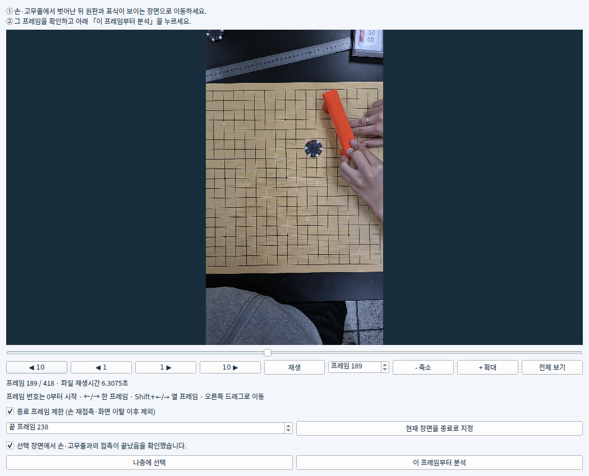

# PokerChip Astra v4 — 실제 영상 검증 보고서

검증 대상: 첨부 PokerChip_Astra_v3.5.zip 및 지정 Google Drive 폴더의 모든 영상. 보고서 생성: 2026-09-29 20:43 KST

실제 영상을 전체 프레임 단위로 실행하면서 추적 누락·개수 추정·좌표 변환·속도 및 회전·충돌 후보·결과 저장·GUI 동작을 검사하고 v4를 수정했습니다. 소프트웨어 실행 완료와 물리 실험의 정확도 인증은 서로 다른 판정입니다.

## 1. 검증 범위와 핵심 결과

| 항목 | 실행 범위 / 결과 |
| --- | --- |
| 원본 영상 | 51개, 30,791프레임, 1,203,010,842바이트. 공급자 파일 크기와 다운로드 크기 일치 |
| 실험 영상 | 49개: 한 칩 18개, 두 칩 25개, 세 칩 6개. 합계 20,710프레임 |
| 보정 영상 | 2개 모두 끝까지 처리. 서로 다른 촬영 세션의 렌즈 보정을 분리 적용 |
| v3.5 기본 조건 | {'complete': 45, 'failed': 1, 'publication_failed': 3} |
| v4 + 해당 세션 렌즈 보정 | {'complete': 49} |
| 참여 칩 개수 불일치 | v3.5 기본 조건 4개 / v4 0개 |
| 계량 좌표 변환 생성 | v3.5 기본 조건 25/49, v4 49/49 — 잠정 격자 좌표 |
| 회귀 테스트 | 동결 v4 기준 104개 통과. validation/test-records/v4의 로그 및 XML. Qt 실제 클릭·프레임 구간 선택 별도 검증 |
| 물리 모델 외부 영상 적용 | 203246에서 적합한 마찰계수를 203310에 고정 적용: 위치 RMSE 8.16 mm, 회전각 RMSE 20.79° |

가장 확실한 추적 결함은 204126의 세 번째 칩 누락입니다. 같은 렌즈 보정을 적용한 v3.5에서도 두 개로 판정했고, v4에서는 세 개를 추적했습니다. 반면 일부 격자·개수 오류는 보정 영상을 넣으면 v3.5에서도 해소됩니다. 보정 입력 효과를 코드 개선 효과와 합쳐 주장하지 않았습니다.

## 2. 비교 방법과 판정 기준

v3.5 기본 배치는 원본 과학 계산 코드를 유지하고 렌즈 보정이 없는 초기 설정으로 49개 실험을 실행했습니다. 이 실행 환경에서 psutil 프로세스 조회가 실패하므로 v3.5 배치 도구에만 메모리 통계 수집 우회를 적용했습니다. 추적·기하·운동학 계산은 수정하지 않았습니다. v4 배치는 각 촬영 세션의 보정 영상에서 추정한 K와 왜곡계수를 사용하고 실험 영상별 바닥 격자 H를 다시 계산했습니다.

추가로 204126과 203502는 동일한 렌즈 보정을 넣은 v3.5 전체 실행을 수행했습니다. 203825와 203834는 v4와 동일한 바닥 기하를 넣고 v3.5 개수 탐색을 따로 검사했습니다. 203132도 올바른 렌즈 보정 상태에서 실패를 재현했습니다. 따라서 기본 배치의 두 버전 간 수치 차이 전체를 코드 수정만의 효과로 해석하면 안 됩니다.

전체 녹화 시험에는 발사 전 손 접촉, 발사기 가림, 화면 밖 이동, 실험 후 재접촉이 포함됩니다. 배치 검사 도구는 이를 명시한 audit_full_recording 범위로 실행했습니다. 이는 사람의 자유운동 시작 승인을 대신하지 않습니다. 실제 배포 GUI의 시작 프레임 확인 조건은 유지했습니다.

사람이 모든 프레임의 정답 중심·각도를 라벨링한 검증은 아닙니다. 모든 프레임을 프로그램으로 처리하고, 전체 영상의 표본 사진·관측 시트와 주요 실패/충돌 구간을 눈으로 대조했습니다. 관측 비율, 원 테두리 잔차, 보정판 재투영 잔차는 독립 정답 기준의 검출 정답률이나 절대 거리 정확도가 아닙니다.

## 3. 실제 영상에서 확인한 문제와 수정

| 문제 | 원인과 증거 | v4 조치 / 남은 한계 |
| --- | --- | --- |
| 세 번째 칩 전체 누락 | 204126: 원본 방식은 동시에 검출된 최대 개수를 중심으로 판정. 세 칩이 동시에 안정적으로 보이는 표본이 부족해 2개로 제한 | 반복된 두 색 표식 ID의 합집합 반영. 같은 렌즈 조건에서 2→3개 |
| 짧은 가시 구간을 놓치는 개수 탐색 | 203132: 보정 후에도 24개 표본에서 0개. 표본을 192개로 늘리면 같은 품질 기준으로 1개 탐색 | 최초 0개인 경우에만 192개 표본 재탐색. 실제 구간의 불량 관측을 임의로 정상화하지 않음 |
| 일부 기본 조건의 격자/개수 오류 | 렌즈 왜곡이 보정되지 않은 격자선이 정밀 선별 기준에서 탈락. 203825·203834는 v3.5도 올바른 기하에서 2개 탐색 | 보정 입력 안내와 실패 사유 보존. 격자 정밀도 임계값을 느슨하게 바꾸지 않음 |
| 참여 ID를 첫 N개로만 선택 | 자동 개수 판정 이후 실제 색 표식과 무관하게 chip_1부터 배정 | 반복 확인된 실제 ID를 먼저 선택하고 나머지만 미확정 슬롯으로 채움 |
| 손·발사기에 추적이 고착 | 203502·203916: 흐린 무표식 후보가 last_frame과 예측 위치를 계속 갱신해 실제 칩의 표식 재획득을 차단 | 두 표식 확인 없이 흐림 경고가 있으면 신뢰 추적 상태를 갱신하지 않음. 마지막 전체 배치로 재검증 |
| 흐린 관측이 속도/회전 계산을 오염 | 경고 필드는 존재해도 대상 또는 이웃의 흐린 표본이 미분 창 및 사건 적합에 포함 | 대상·이웃·충돌 전후·자유운동 적합에서 제외. 데이터가 부족하면 빈값 유지 |
| 중단 버튼 예외 | GUI는 Control.cancel()을 호출하지만 원본 Control에는 메서드가 없음 | cancel/pause/resume 추가. 중단 시 pause 해제. 실제 Qt 버튼 클릭 검증 |
| 결과 저장 단계 DB 읽기 실패 | 203542·203558·203801에서 database disk image is malformed. 원시/분석 캐시와 결과 DB 상태가 다름 | 백업 API·연결 명시적 종료·읽기 전용 접근·완료 JSONL로 출력. 초기 v4에서도 두 건 재현되어 추가 수정. 환경별 손상의 유일 원인은 확정하지 못함 |
| 실행 환경 통계 오류로 분석 중단 | psutil.Process().memory_info() 예외가 분석 시작/진행 경로로 전파 | 메모리 통계 unavailable로 기록하고 측정 지속 |
| 시작 프레임 이후 확인 사진 불일치 | 사진 선택이 실제 프레임 번호 대신 0~관측 행 수에 의존 | 저장된 실제 프레임 인덱스 기반 선택 |
| 구간·검토 GUI의 불편 | 종료 프레임 제한이 없고 여러 영상 추가/추적 영상 내보내기 접근성이 낮음 | 종료 프레임, 폴더 추가, 추적 표시 영상 저장, 상태 안내, 테이블 갱신 빈도 개선 |

저장 문제의 남은 한계: 최종 고정 코드 배치에서도 200141 영상에서 결과 DB 읽기 손상이 1회 발생했습니다. 원시 DB와 분석 캐시는 무결성 검사를 통과했고, 코드를 바꾸지 않은 재실행으로 결과를 복구했습니다. 표의 최종 완료 상태에는 이 재시도가 포함됩니다. Python 표준 SQLite만 사용하는 별도 40회 검사에서는 문제가 재현되지 않았으므로, 간헐 손상의 유일한 원인은 아직 확정하지 못했습니다. 저장 문제가 완전히 사라졌다는 결론은 내리지 않습니다.

### 3.1 같은 보정 조건의 세 칩 대조

| 204126 / 동일 렌즈 | v3.5 | v4 |
| --- | --- | --- |
| 참여 칩 | 2 | 3 |
| 관측 행 수 | 695 | 1,008 |
| 속도 계산 행 수 | 677 | 947 |
| 각속도 계산 행 수 | 665 | 947 |

행 수는 칩×프레임 단위입니다. 참여 칩 수가 달라 분모가 바뀌므로 위 증가량을 정확도 향상률로 바꿔 쓰면 안 됩니다. v4가 찾은 충돌 후보는 chip_1–chip_2의 256~260프레임(최접근 258), chip_2–chip_3의 273~278프레임(최접근 275)입니다. 두 사건 모두 신뢰할 수 있는 전후 표본이 부족하여 충돌계수 확정 대상에서 제외되었습니다.

### 3.2 영상 203132의 탐색 누락

올바른 보정으로도 기존의 24개 표본 탐색 결과는 0개였습니다. 192개 표본 재탐색에서는 214·218·238·252·347프레임에 원 후보가 품질 기준을 통과했고, 제안 개수가 1개가 되었습니다. 이 결과는 개수 제안이며, 각 후보가 모두 독립 정답 판정된 관측이라는 뜻은 아닙니다. v4는 실패를 즉시 종료하기 전에 이 추가 시간 탐색을 수행합니다.

최종 전체 실행에서는 652프레임 중 관측 50행이 남았고, 그중 35행에는 흐림 경고가 붙었습니다. 물리 속도와 각속도는 각각 5행뿐입니다. 따라서 자동 탐색 실패는 해소했지만, 이 영상으로 자유운동 전체나 물리 계수를 신뢰성 있게 추정할 근거는 부족합니다. 전체 녹화에는 칩이 가려지거나 화면 밖인 구간도 있으므로 50/652를 검출 정답률로 읽으면 안 됩니다.

### 3.3 손·발사기에 고정되던 잘못된 궤적

동일한 렌즈 보정을 적용한 v3.5와 초기 v4 검증 빌드 모두 흐린 무표식 원 후보가 chip_1의 최근 위치를 계속 갱신했습니다. 실제 칩에 두 색 표식이 보여도 이전 잘못된 예측과의 거리가 허용 범위를 넘어서 재획득이 차단되었습니다. 149프레임의 잘못된 중심은 (856.7, 893.3) px였고, 최종 v4는 실제 칩 위치인 약 (319.6, 822.4) px로 돌아왔습니다. 좌표는 검출 중심이며 독립 정답 오차 수치가 아닙니다.

흐림 경고만 있고 두 표식이 확인되지 않으면 신뢰 추적 상태를 갱신하지 않게 했습니다. 오래된 추적이 정상적으로 만료되어 실제 표식으로 다시 연결됩니다. 203502의 초기 v4 대비 최종 v4에서 속도 계산 행은 298→511, 흐림 경고 행은 268→6으로 바뀌었습니다. 이는 검증 도중 확인한 중간 빌드와의 비교입니다. 같은 보정 조건의 v3.5는 268개 흐림 경고 관측을 포함한 상태에서 속도를 548행 계산했으므로, 단순히 계산된 숫자가 많다고 더 좋은 결과는 아닙니다.

## 4. 시뮬레이션이 실제 궤적과 다른 정도

단일 칩 영상 203246에서 손이 떨어진 뒤 구간을 사용해 기존 Farkas 모델의 바닥 마찰계수를 탐색 적합했습니다. 명목 격자·시간·관성 가정 아래 μ=0.3364128이 나왔고, 적합 구간은 200~243프레임 44개 관측입니다. 이 구간의 위치 RMSE는 약 0.384 mm, 회전각 RMSE는 약 1.296°였습니다.

같은 촬영 세션의 다른 영상 203310에는 μ를 그대로 고정했습니다. 186~197프레임의 12개 초기 관측으로 위치·속도·각도·각속도의 초기 상태만 구하고, 그 초기 구간을 점수에서 제외했습니다. 이후 198~374프레임을 예측했습니다. 시험 영상의 마찰계수는 다시 맞추지 않았습니다.

| 측정값 | 다른 영상 203310 |
| --- | --- |
| 평가 시간 | 0.7342초 / 선언된 물리 시간 |
| 위치 RMSE | 8.156 mm |
| 최대 위치 차이 | 9.700 mm |
| 회전각 RMSE | 20.786° |
| 관찰된 차이 | 예측 정지 위치가 관측 궤적보다 짧고, 회전량은 더 큼 |

한 영상에 잘 맞는 계수가 다른 영상까지 잘 예측한다는 결론은 성립하지 않았습니다. 마찰/압력 분포/관성 가정의 부적합, 실험 조건 차이, 추적 및 보정 오차가 함께 작용할 수 있습니다. 이 자료만으로 그중 하나를 유일한 원인이라고 특정하지 않았고, 시험 영상에 재적합하여 차이를 숨기지 않았습니다. 모델의 일반화 문제는 남은 한계입니다. 다른 촬영 세션까지의 검증도 수행하지 않았습니다.

| 추가 시험 영상 | 평가 시간 | 위치 RMSE | 회전각 RMSE |
| --- | --- | --- | --- |
| 20260928_203408.mp4 | 0.9470 s | 4.293 mm | 10.279° |
| 20260928_203122.mp4 | 0.0459 s | 0.512 mm | 0.895° |

추가 시험도 마찰계수는 다시 맞추지 않았습니다. 203408은 385프레임 이후, 203122는 180프레임 이후의 손에서 분리된 구간을 확인해 사용했습니다. 각 영상에서 품질 기준을 만족하는 연속 구간 길이가 다르므로 짧은 예측의 낮은 오차를 긴 예측과 같은 조건으로 비교하거나 단순 평균하면 안 됩니다. 전체 49개에 대해 물리 모델 계수 적합을 수행한 것은 아닙니다.

## 5. 보정·시간·물성의 해석

| 보정 영상 | 프레임 | 렌즈 시점 수 | 별도 구간 재투영 RMS | 사용 대상 |
| --- | --- | --- | --- | --- |
| 20260928_200058.mp4 | 5846 | 60 | 0.3457 px | 20:01~20:04 실험 |
| 20260928_203026.mp4 | 4235 | 60 | 0.4238 px | 20:31 이후 실험 |

두 보정 영상 모두 끝부분 보정판의 안정 상태 검사를 통과했습니다. 다만 사람이 보정판과 실험면의 동일 평면임을 확인했다고 조작하지 않았습니다(floor_confirmed=False). 렌즈 계수만 사용하고 실험 영상의 바닥 격자로 평면 변환을 따로 구했습니다. 보정 잔차는 같은 판/격자의 내부 일관성 검사입니다.

| 항목 | 이번 계산의 가정 | 정확한 실험값으로 확정하려면 |
| --- | --- | --- |
| 격자 | 22.5 mm / 23.8889 mm, 기존 설정 | 실제 바닥 격자 간격의 독립 측정 |
| 칩 | 지름 40 mm, 질량 12 g, 균질 원판 관성 | 칩별 지름·질량·관성/질량 분포 확인 |
| 시간 | 재생 PTS ÷ 8. Android 메타데이터에는 촬영 240 fps | 외부 시간 기준 또는 실제 캡처 시간 확인 |
| 각도 | 표식 관측과 500 rad/s 각속도 상한을 사용한 조건부 unwrap | 빠른 회전의 앨리어싱과 가려진 표식 검토 |
| 면 | 근사 평면 및 거의 수직인 카메라의 격자 모델 | 들림·기울어짐·프레임별 카메라 이동 검사 |

## 6. GUI 변경 및 실행 안내

저장소 루트에서 Windows는 SETUP.cmd를 실행한 뒤 RUN.cmd를 실행하세요. Python 3.12와 패키지 설치용 인터넷이 필요합니다. 독립 EXE 패키지는 아닙니다. 새 폴더의 가상환경을 권장합니다. 해당 세션의 보정 영상을 먼저 선택하고, 실험 영상을 폴더로 추가한 다음 실제 칩 개수와 손 접촉이 끝난 시작 프레임을 확인하세요. 종료 프레임으로 재접촉·화면 이탈 구간을 제한할 수 있습니다.

검증 환경은 Linux / CPython 3.12 / PySide6 offscreen입니다. Windows 실행 스크립트는 검토했으나 Windows 실기기에서 실행하지 않았습니다. 고정 의존성은 requirements-v4-tested.txt에 있습니다. 동일 픽셀 회색조 재사용은 측정 해상도를 줄이지 않으며, 시간·메모리 성능의 공정한 벤치마크 수치로는 제시하지 않습니다.

## 7. 전체 51개 영상별 결과

아래 “완료”는 분석 및 결과 저장 완료를 뜻합니다. 관측률은 전체 녹화에서 등록된 칩×프레임 대비 관측 행 비율로, 가림·화면 이탈·손 접촉을 포함하므로 정답률이 아닙니다. 물리량 행 수가 0이거나 사건이 “unmeasurable”이면 값을 0으로 해석하지 마세요. 파일명에는 날짜 접두사 20260928_가 공통으로 붙습니다.

| 영상 시각 | 프레임 | 실제 칩 | v3.5 기본 개수 / 상태 | v4 개수 / 상태 | v4 관측률 | 속도 / 각속도 행 | 검토 사항 |
| --- | --- | --- | --- | --- | --- | --- | --- |
| 200131 | 383 | 2 | 2 / 완료 | 2 / 완료 | 62.5% | 418 / 418 | 흐림 35행; 사건 1개 |
| 200141 | 327 | 2 | 2 / 완료 | 2 / 완료 (재시도) | 97.2% | 558 / 558 | 흐림 28행; 사건 1개 |
| 200214 | 249 | 2 | 2 / 완료 | 2 / 완료 | 94.0% | 437 / 437 | 흐림 13행; 사건 1개 |
| 200221 | 348 | 2 | 2 / 완료 | 2 / 완료 | 61.5% | 387 / 387 | 흐림 17행; 사건 1개 |
| 200228 | 253 | 2 | 2 / 완료 | 2 / 완료 | 99.8% | 472 / 472 | 흐림 16행; 사건 1개 |
| 200234 | 245 | 2 | 2 / 완료 | 2 / 완료 | 96.5% | 449 / 449 | 흐림 10행; 사건 1개 |
| 200240 | 411 | 2 | 2 / 완료 | 2 / 완료 | 60.7% | 454 / 454 | 흐림 20행; 사건 1개 |
| 200247 | 327 | 2 | 2 / 완료 | 2 / 완료 | 99.5% | 584 / 584 | 흐림 37행; 사건 1개 |
| 200256 | 503 | 2 | 2 / 완료 | 2 / 완료 | 99.3% | 941 / 941 | 흐림 25행; 사건 1개 |
| 200419 | 181 | 2 | 2 / 완료 | 2 / 완료 | 94.5% | 314 / 314 | 흐림 15행; 사건 1개 |
| 203122 | 566 | 1 | 1 / 완료 | 1 / 완료 | 26.3% | 110 / 45 | 흐림 24행 |
| 203132 | 652 | 1 | 1 / 분석 실패 | 1 / 완료 | 7.7% | 5 / 5 | 흐림 35행 |
| 203143 | 412 | 1 | 1 / 완료 | 1 / 완료 | 96.6% | 136 / 136 | 흐림 55행 |
| 203149 | 529 | 1 | 1 / 완료 | 1 / 완료 | 44.2% | 208 / 208 | 흐림 14행 |
| 203208 | 345 | 1 | 1 / 완료 | 1 / 완료 | 99.1% | 320 / 242 | 흐림 14행 |
| 203218 | 257 | 1 | 1 / 완료 | 1 / 완료 | 99.6% | 218 / 196 | 흐림 18행 |
| 203226 | 357 | 1 | 1 / 완료 | 1 / 완료 | 15.4% | 30 / 30 | 흐림 18행 |
| 203246 | 419 | 1 | 1 / 완료 | 1 / 완료 | 100.0% | 410 / 275 | 흐림 6행 |
| 203256 | 385 | 1 | 1 / 완료 | 1 / 완료 | 57.1% | 140 / 88 | 흐림 40행 |
| 203301 | 358 | 1 | 1 / 완료 | 1 / 완료 | 50.6% | 24 / 24 | 흐림 78행 |
| 203310 | 375 | 1 | 1 / 완료 | 1 / 완료 | 98.4% | 224 / 211 | 흐림 81행 |
| 203317 | 395 | 1 | 1 / 완료 | 1 / 완료 | 98.0% | 285 / 236 | 흐림 50행 |
| 203323 | 666 | 1 | 1 / 완료 | 1 / 완료 | 13.8% | 48 / 48 | 흐림 18행 |
| 203333 | 385 | 1 | 1 / 완료 | 1 / 완료 | 69.4% | 179 / 179 | 흐림 36행 |
| 203342 | 345 | 1 | 1 / 완료 | 1 / 완료 | 60.3% | 185 / 185 | 흐림 19행 |
| 203353 | 396 | 1 | 1 / 완료 | 1 / 완료 | 55.6% | 192 / 192 | 흐림 14행 |
| 203359 | 413 | 1 | 1 / 완료 | 1 / 완료 | 54.0% | 32 / 32 | 흐림 119행 |
| 203408 | 805 | 1 | 1 / 완료 | 1 / 완료 | 99.8% | 404 / 404 | 흐림 61행 |
| 203502 | 298 | 2 | 2 / 완료 | 2 / 완료 | 91.1% | 511 / 511 | 흐림 6행; 사건 1개 |
| 203542 | 317 | 2 | 2 / 결과 저장 실패 | 2 / 완료 | 82.6% | 499 / 499 | 흐림 10행; 사건 1개 |
| 203558 | 315 | 2 | 1 / 결과 저장 실패 | 2 / 완료 | 64.8% | 343 / 343 | 기본 v3.5 개수 불일치; 흐림 32행; 사건 1개 |
| 203634 | 397 | 2 | 2 / 완료 | 2 / 완료 | 99.1% | 733 / 733 | 흐림 18행; 사건 1개 |
| 203640 | 306 | 2 | 2 / 완료 | 2 / 완료 | 80.7% | 413 / 357 | 흐림 33행; 사건 1개 |
| 203703 | 353 | 2 | 2 / 완료 | 2 / 완료 | 75.2% | 485 / 485 | 흐림 21행; 사건 1개 |
| 203717 | 300 | 2 | 2 / 완료 | 2 / 완료 | 99.7% | 544 / 544 | 흐림 23행; 사건 1개 |
| 203723 | 416 | 2 | 2 / 완료 | 2 / 완료 | 94.1% | 693 / 693 | 흐림 25행; 사건 1개 |
| 203744 | 529 | 2 | 2 / 완료 | 2 / 완료 | 95.8% | 911 / 745 | 흐림 32행; 사건 1개 |
| 203801 | 454 | 2 | 2 / 결과 저장 실패 | 2 / 완료 | 77.5% | 670 / 670 | 흐림 17행; 사건 1개 |
| 203825 | 885 | 2 | 1 / 완료 | 2 / 완료 | 60.3% | 981 / 915 | 기본 v3.5 개수 불일치; 흐림 26행; 사건 1개 |
| 203834 | 409 | 2 | 1 / 완료 | 2 / 완료 | 70.8% | 446 / 427 | 기본 v3.5 개수 불일치; 흐림 41행; 사건 1개 |
| 203902 | 438 | 2 | 2 / 완료 | 2 / 완료 | 73.9% | 616 / 616 | 흐림 12행; 사건 1개 |
| 203909 | 449 | 2 | 2 / 완료 | 2 / 완료 | 69.7% | 566 / 566 | 흐림 24행; 사건 1개 |
| 203916 | 446 | 2 | 2 / 완료 | 2 / 완료 | 82.6% | 648 / 648 | 흐림 51행; 사건 1개 |
| 204041 | 599 | 3 | 3 / 완료 | 3 / 완료 | 82.2% | 1277 / 1216 | 흐림 136행; 사건 2개 |
| 204052 | 443 | 3 | 3 / 완료 | 3 / 완료 | 97.1% | 1167 / 1032 | 흐림 55행; 사건 2개 |
| 204111 | 455 | 3 | 3 / 완료 | 3 / 완료 | 99.3% | 1202 / 1121 | 흐림 74행; 사건 1개 |
| 204117 | 597 | 3 | 3 / 완료 | 3 / 완료 | 87.4% | 1424 / 1406 | 흐림 63행; 사건 1개 |
| 204126 | 466 | 3 | 2 / 완료 | 3 / 완료 | 72.1% | 947 / 947 | 기본 v3.5 개수 불일치; 흐림 42행; 사건 2개 |
| 204134 | 551 | 3 | 3 / 완료 | 3 / 완료 | 99.5% | 1372 / 1128 | 흐림 139행; 사건 3개 |

보정 영상 200058과 203026은 위 5절에 별도로 기록했습니다. 나머지 49개와 합쳐 폴더의 51개 전체입니다. 영상별 자세한 사건 프레임, 연속 검토 구간, 품질 정보, 궤적 및 원본 SHA-256은 archive/releases/v4.0.0의 동결 ZIP에 있습니다.

### 7.1 특히 유효 운동학 관측이 적은 영상

| 영상 | 전체 프레임 | 관측 행 | 속도 행 | 각속도 행 | 흐림 경고 행 |
| --- | --- | --- | --- | --- | --- |
| 203132 | 652 | 50 | 5 | 5 | 35 |
| 203301 | 358 | 181 | 24 | 24 | 78 |
| 203226 | 357 | 55 | 30 | 30 | 18 |
| 203359 | 413 | 223 | 32 | 32 | 119 |
| 203323 | 666 | 92 | 48 | 48 | 18 |

이 영상들은 처리 완료 상태여도 물리 모델 적합에 사용할 연속·선명 표본이 짧습니다. 화면 이탈과 발사 전 가림이 많아 전체 녹화 관측률만으로 검출 성능을 비교하지 않았습니다.

### 7.2 충돌 후보별 정확한 프레임과 보류 사유

| 영상 | 쌍 | 후보 구간 | 최접근 | 판정 | 사유 |
| --- | --- | --- | --- | --- | --- |
| 200131 | chip_1/chip_2 | 165~172 | 169 | 계측 불충분 | 시간/기하/고립 전후 표본 부족 |
| 200141 | chip_1/chip_2 | 123~129 | 126 | 계측 불충분 | 연속된 전후 표본 3개 이상 필요 |
| 200214 | chip_1/chip_2 | 46~51 | 48 | 계측 불충분 | 연속된 전후 표본 3개 이상 필요 |
| 200221 | chip_1/chip_2 | 111~116 | 113 | 계측 불충분 | 연속된 전후 표본 3개 이상 필요 |
| 200228 | chip_1/chip_2 | 48~54 | 51 | 계측 불충분 | 연속된 전후 표본 3개 이상 필요 |
| 200234 | chip_1/chip_2 | 28~33 | 30 | 고립 이체 후보 | 사건 승인 필요 |
| 200240 | chip_1/chip_2 | 31~35 | 33 | 계측 불충분 | 시간/기하/고립 전후 표본 부족 |
| 200247 | chip_1/chip_2 | 120~125 | 123 | 계측 불충분 | 연속된 전후 표본 3개 이상 필요 |
| 200256 | chip_1/chip_2 | 217~223 | 220 | 비접촉 통과 후보 | 명확한 중심 간격 + 상대 원판의 전후 정지 유지 · 비접촉 통과 후보 |
| 200419 | chip_1/chip_2 | 31~36 | 33 | 계측 불충분 | 시간/기하/고립 전후 표본 부족 |
| 203502 | chip_1/chip_2 | 75~84 | 78 | 근접 지속 후보 | 전후 상태와 시간/기하 검토 필요 |
| 203542 | chip_1/chip_2 | 121~127 | 123 | 계측 불충분 | 연속된 전후 표본 3개 이상 필요 |
| 203558 | chip_1/chip_2 | 114~119 | 116 | 계측 불충분 | 연속된 전후 표본 3개 이상 필요 |
| 203634 | chip_1/chip_2 | 209~214 | 211 | 계측 불충분 | 연속된 전후 표본 3개 이상 필요 |
| 203640 | chip_1/chip_2 | 118~122 | 120 | 고립 이체 후보 | 사건 승인 필요 |
| 203703 | chip_1/chip_2 | 113~117 | 115 | 계측 불충분 | 연속된 전후 표본 3개 이상 필요 |
| 203717 | chip_1/chip_2 | 59~64 | 61 | 계측 불충분 | 연속된 전후 표본 3개 이상 필요 |
| 203723 | chip_1/chip_2 | 182~187 | 184 | 계측 불충분 | 연속된 전후 표본 3개 이상 필요 |
| 203744 | chip_1/chip_2 | 276~281 | 279 | 계측 불충분 | 연속된 전후 표본 3개 이상 필요 |
| 203801 | chip_1/chip_2 | 229~235 | 233 | 계측 불충분 | 연속된 전후 표본 3개 이상 필요 |
| 203825 | chip_1/chip_2 | 145~153 | 149 | 계측 불충분 | 연속된 전후 표본 3개 이상 필요 |
| 203834 | chip_1/chip_2 | 143~156 | 149 | 근접 지속 후보 | 전후 상태와 시간/기하 검토 필요 |
| 203902 | chip_1/chip_2 | 245~251 | 248 | 고립 이체 후보 | 사건 승인 필요 |
| 203909 | chip_1/chip_2 | 269~273 | 272 | 계측 불충분 | 연속된 전후 표본 3개 이상 필요 |
| 203916 | chip_1/chip_2 | 169~174 | 172 | 계측 불충분 | 연속된 전후 표본 3개 이상 필요 |
| 204041 | chip_1/chip_2 | 362~366 | 364 | 계측 불충분 | 시간/기하/고립 전후 표본 부족 |
| 204041 | chip_2/chip_3 | 374~380 | 377 | 계측 불충분 | 시간/기하/고립 전후 표본 부족 |
| 204052 | chip_1/chip_2 | 196~201 | 198 | 계측 불충분 | 연속된 전후 표본 3개 이상 필요 |
| 204052 | chip_2/chip_3 | 220~228 | 224 | 고립 이체 후보 | 사건 승인 필요 |
| 204111 | chip_1/chip_2 | 239~246 | 242 | 고립 이체 후보 | 사건 승인 필요 |
| 204117 | chip_1/chip_2 | 338~345 | 341 | 계측 불충분 | 연속된 전후 표본 3개 이상 필요 |
| 204126 | chip_1/chip_2 | 256~260 | 258 | 계측 불충분 | 시간/기하/고립 전후 표본 부족 |
| 204126 | chip_2/chip_3 | 273~278 | 275 | 계측 불충분 | 시간/기하/고립 전후 표본 부족 |
| 204134 | chip_1/chip_2 | 254~259 | 257 | 계측 불충분 | 연속된 전후 표본 3개 이상 필요 |
| 204134 | chip_2/chip_3 | 272~275 | 274 | 근접 동시 후보 | 접촉 그래프 시간 구간 중첩 |
| 204134 | chip_2/chip_3 | 275~281 | 276 | 근접 동시 후보 | 접촉 그래프 시간 구간 중첩 |

프레임은 0부터 세는 디코딩 인덱스입니다. 근접 지속·동시 후보는 영상에서 실제 접촉 형태를 확정한 라벨이 아닙니다. 전후 관측 또는 사건 검토가 부족하면 계수를 비워 두는 것이 정상이며, 빈 값을 반발계수 0으로 바꾸면 안 됩니다.

## 8. 재현 자료와 남은 검증

results/v4/summaries/video_summary.csv는 전체 영상 비교표, all_results.json은 상세 요약입니다. 전체 영상별 산출물은 archive/releases/v4.0.0의 동결 ZIP에 보존했고, results/v4/evidence에는 보고서가 직접 사용하는 보정값·모델 검증·GUI 증거만 선별했습니다.

개발 도중 발견한 오류를 추가 수정한 뒤 코드를 고정하고 최종 v4로 실험 49개 전체를 다시 실행했습니다. 본 비교표의 v4 데이터는 이 마지막 배치입니다. 모든 최종 run manifest의 code_hash를 배포 소스와 대조했습니다. 중간 빌드 자료는 원인 비교 증거로만 별도 표시하며, 배포 데이터와 섞지 않았습니다.

남은 검증은 독립 정답 라벨에 의한 중심·각도 오차, 외부 시간·길이 검증, 충돌 전후의 고립 표본과 사건 승인, 다른 촬영 세션의 물리 모델 예측, Windows 실기기 실행입니다. v4는 확인된 코드 오류를 수정하고 오류 원인과 검토 대상을 더 잘 드러내지만, 현재 자료에서 모든 물리 계수가 검증되었다고 주장하지 않습니다.
